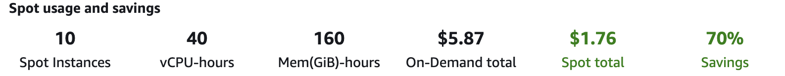

# CDK-Folding@Home

Run [Folding@Home](https://foldingathome.org/home/) with this prebuild CDK library and never forget to shut off expensive instances.
With built-in TTL for your stack, you just define the lifetime of your instances and the stack will be destroyed afterwards.

### About Folding@Home

Folding@home is a project focused on disease research. The problems F@H is solving require many computer calcul­ations – so you can donate your excess compute power to help their research.
In that sense, you are part of a huge distributed supercomputer!

The architecture follows this AWS [blog post](https://aws.amazon.com/blogs/compute/foldinghome-infectious-disease-research-with-spot-instances/) and leverages g4dn.xlarge Spot EC2 instances to maximise GPU vs price efficiency. 

Running at spot price drastically reduces the price from 0.59$ per hour to around 0.17 in eu-west-1. That's a nice 70% in savings.



I hope you enjoy this package and together we can make a difference and help the [Folding@Home](https://foldingathome.org/home/) program to succeed in their mission!

### Progress
After deployment, you can go into CloudWatch logs and open the log group *fahlog*.
You can now see the progress every one of your instances makes towards the goal of unfolding proteins.

wu01 represents the work of the GPU and wu00 is the work of the CPU .

Big thanks to [cdk-time-bomb](https://github.com/jmb12686/cdk-time-bomb) for the TTL function and [Ash Belmokadem](https://thecloudboss.nl/) and Vikin Shetty for debugging help!

## How to use it

1. Create a new CDK app

2. Install CDK-Folding@Home in your CDK app

``` Bash
npm install cdkfoldingathome
```

3. Open your *stack*.ts file in ./bin

4. Import cdkfoldingathome

``` Typescript
import * as folding from 'cdkfoldingathome';

```
5. Create folding stack - *important to specify accountId and region*

``` Typescript
const fah = new folding.FoldingathomeStack(app, 'folding', {
    timeToLive: cdk.Duration.hours(5),
    spotPrice: '0.40',
    numberOfInstances: 10,
    env: {
        account: "754950554578",
        region: "eu-west-1"
    }
})
```

6. Ready to build and deploy!

7. Your stack gets destroyed once the TTL is up

8. Double-check the first time to be sure your stack got really deleted 😉

If you have any questions reach out on Github or [Twitter](https://twitter.com/win_bv).